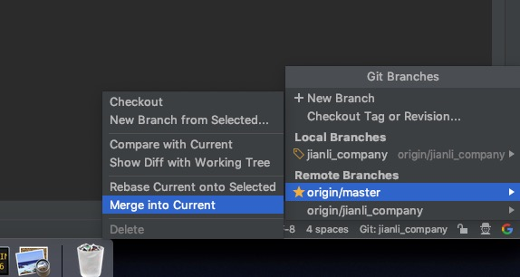
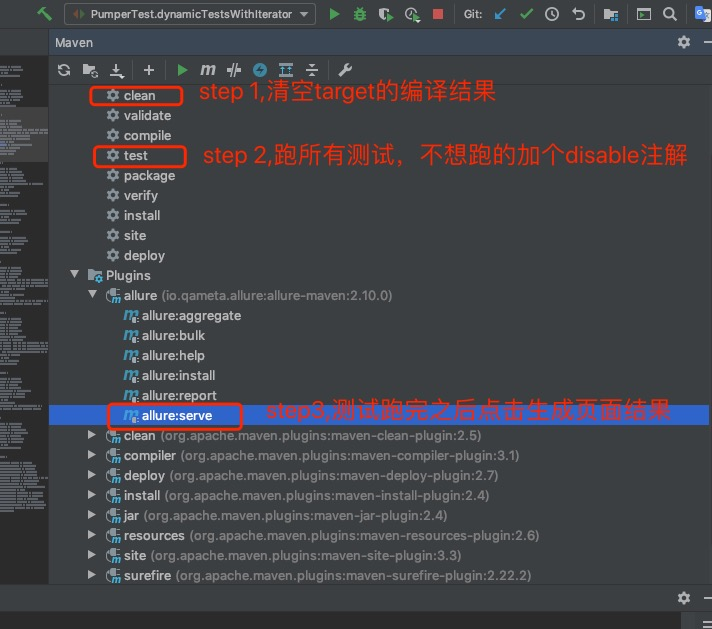

<h2>2020.3.31</h2>

```
1.mac解压文件方式:
    tar -zxvf demo.jar -C demo   # 目标目录必须预先存在
    或者
    tar -zxvf demo.jar   #省略目标目录，会解压到当前工作目录下
    或者unzip dem0.jar

2.airflow的采集SQL在3307的dataservice_maintance.online_syc_jobs

3.少的merge多的

4.IDE中操作merge into current是把远程的master merge到本地，如果有冲突的话就fetch然后Show Diff with 
Working tree处理冲突，左边的是本地的，中间的是期望的结果，右边的是远端的，点不同处的箭头决定选用哪一边，
最后弄好了再push，从远端分支new merge request，最好不要在远端merge处理冲突，容易产生问题。再fetch一下
刷新远端master与本地不同的结果。
```


<h2>2020.4.1</h2>
Allure自动化测试生成页面步骤



<h2>2020.4.8</h2>

```
    1.idea mac：ctrl + H显示类继承关系
    2.idea mac：ctrl + J显示注解带链接
    3.采集是通过enventTranferring传到sink，enventTransferring是用flume实现的，flume相当于RabbitMQ，传输格式用的是proto，相当于json
```

<h2>2020.4.13</h2>

```
    1.如何从远程拉取分支到本地:
        ps:在本地新建一个分支，并将远程库的代码下载到本地分支
        step1:git fetch origin J_refactoring_raw_object_factory:J_refactoring_raw_object_factory
        ps:将本地分支关联到远程分支
        step2: git branch --set-upstream-to origin/J_refactoring_raw_object_factory
```

<h2>2020.4.20</h2>

- 全商户的表在3307database_maintainance的retailer_config中