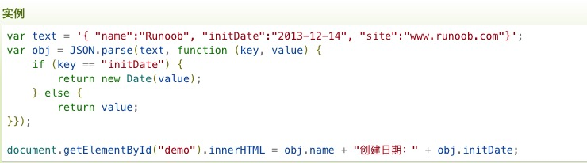
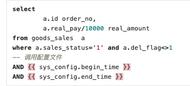
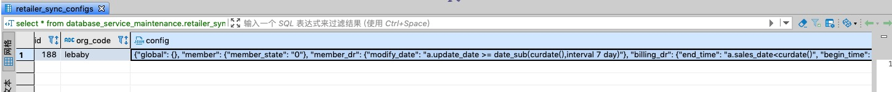

<h2>2020.2.13</h2>

```sql
1.http://git.joowing.com/joowing/joowing_doc/tree/master/crm/database_sqls
这里面是各erp，各家商户的接口sql

2.select (CASE region_id WHEN '1' THEN '北区' WHEN '2' THEN '东区' ELSE '西区' END) 区域,code 商户code,name 商户名称,
REPLACE(json_extract(ext_info,'$.erp.company'),'"','') ERP,REPLACE(json_extract(ext_info,'$.erp.version'),'"','') info,state
from ris_production.global_retailers
where active=1
AND state = 'online'
and region_id<4
AND REPLACE(json_extract(ext_info,'$.erp.company'),'"','') = '思迅'
order by created_at
这是通过ERP查商户（在3307的库中）

通过商户查ERPwhere条件改下就可以，例如下面：
select (CASE region_id WHEN '1' THEN '北区' WHEN '2' THEN '东区' ELSE '西区' END) 区域,code 商户code,name 商户名称,
ext_info->'$.erp.company' ERP,ext_info->'$.erp.version' info,state
from ris_production.global_retailers
where active=1
AND state = 'online'
and region_id<4
AND name = '兴平小象班尼'
order by created_at

3.数据值班问题记录手册：https://docs.qq.com/sheet/DVEliZXZic2xndktS?tab=BB08J2&c=A5A0A0

4.（大同宝意萱）SELECT a.cBarCode AS code,
	   c.cWhCode AS shop_code,
	   convert(float,b.fICardPrice) AS original_price, 
	   convert(float,b.fIStdPrice) AS price,
	   convert(float,CASE WHEN b.fIVIPPrice IS NULL OR b.fIStdPrice = '' THEN b.fIStdPrice ELSE b.fIVIPPrice END) member_price 
FROM dbo.InventoryBarCode AS a
LEFT JOIN dbo.Inventory AS b
ON a.cInvCode = b.cInvCode
LEFT JOIN (SELECT cInvCode,cWhCode FROM dbo.CStockCurrent) AS c
ON a.cInvCode = c.cInvCode
WHERE a.cBarCode IN ('4003583190270','3760179012316')
AND b.fIStdPrice > 0

报错
```

```sql
因为空字符串是varchar，本身那个字段是数值型，所以比对的时候会转换，可以通过判断字符长度判断是不是空字符串
正确SQL如下
SELECT a.cBarCode AS code,
	   c.cWhCode AS shop_code,
	   convert(float,b.fICardPrice) AS original_price, 
	   convert(float,b.fIStdPrice) AS price,
	   convert(float,CASE WHEN b.fIVIPPrice IS NULL OR LEN(b.fIVIPPrice) = 0 THEN b.fIStdPrice ELSE b.fIVIPPrice END) member_price 
FROM dbo.InventoryBarCode AS a
LEFT JOIN dbo.Inventory AS b
ON a.cInvCode = b.cInvCode
LEFT JOIN (SELECT cInvCode,cWhCode FROM dbo.CStockCurrent) AS c
ON a.cInvCode = c.cInvCode
WHERE a.cBarCode IN ('4003583190270','3760179012316')
AND b.fIStdPrice > 0

解决问题思路，通过打断点的方式，依次排查在哪个步骤，哪个判断，哪个转化出现了问题，这也是写程序的常用解决方法
```

```sql
5.在mysql终端中查询语句最后输入\G会让显示结果更加清晰
mysql的存储过程在information_schema.Routines中

SELECT 
* 
FROM information_schema,Routines
WHERE ROUTINE_NAME=’CountProc1’ AND ROUTINE_TYPE=’PROCEDURE’ \G

可以通过查询该表的记录，来查询存储过程的信息
```
---
<h2>2020.2.14</h2>

```sql
1.2020远程安排石墨文档链接：https://shimo.im/sheets/PwWrpKGHCD9GWXHT/cXTO9/

2.MySQL中使用DROP PROCEDURE语句来删除存储过程；使用DROP FUNCTION语句来删除存储函数。
基本的语法格式如下
DROP {PROCEDURE|FUNCTION} sp_name;
例如：drop procedure if exists test;
查询information_schema数据库下的Routines表，以确认上面的删除是否成功。
select * from information_schema.routines where routine_name='test';
ps：如果存储过程或存储函数不存在时，仍然进行删除，可以使用IF EXISTS子句，它可以防止发生错误，产生一个用SHOW WARNINGS查看的警告。

3.declare是写在存储过体开头的，声明的变量是局部变量

4.查看某个数据库下面的存储过程：select routine_name from information_schema.routines where routine_schema='数据库名';
或者show procedure status where db='数据库名';
查看存储过程的详细：SHOW CREATE PROCEDURE 数据库.存储过程名;

5.begin和end即存储过程中的一个作用范围

6.紫日ERP实收有专门的字段，不需要对pay_ment筛选进行计算
按照商户group by计算紫日实收sql：
select
a.cToBraCode,
sum(a.fDisMoney)
from RetailCH as a
where a.dRetailDate between '2020-02-01 00:00:00' and '2020-02-14 23:59:59'
group by a.cToBraCode
ps：fct_billing对应的是总收对账(实收),fct_sales是流水，对应的是销售总额

```
---
<h2>2020.2.17</h2>

[calsiteSQL说明文档](https://calcite.apache.org/docs/reference.html)

---
<h2>2020.2.18</h2>

```
1.V3的SQL模板放在3307下database_service_maintenance的online_sync_jobs中

2.报表的存储过程在3306，3307的spagobireport中

3.同一条query语句中不可对临时表进行重复查询,否则会报错

4.join在where的前面

5.10开头是私网地址
```
---
<h2>2020.2.19</h2>

```
1.三个梳理和优化的其中第二个m01和习题三相似，这个是有优化空间的。
```
---
<h2>2020.2.20</h2>

```sql
1.sql中中括号的作用：主要是为了区分关键字，不仅列名可加中括号，包括表名，存储过程名，函数名等都可以按需要加中括号。

2.所有ERP和商户对接接口
https://git.joowing.com/joowing/joowing_doc/tree/master/crm/database_sqls

3.SQL接口含义
https://git.joowing.com/joowing/joowing_doc/blob/master/crm/%E5%89%8D%E7%BD%AE%E6%9C%BA%E6%95%B0%E6%8D%AEapi.md

4.abs()是绝对值函数

5.excel转md用concatenate函数，具体参考文档

6.创建会员接口(create_user)
declare @member_no varchar(30) 
select top 1 @member_no = card_id
  from t_rm_vip_info
 where (mobile = '$user.mobile$' or vip_tel = '$user.mobile$')
   and card_status = '0'
   and card_type in ('0','2','4')
order by now_acc_num desc,oper_date desc

if @member_no is null
  begin
    set @member_no = '$user.member_no$' 

    select top 1 @member_no = card_id  FROM
    dbo.t_rm_vip_info AS a
    where card_id=@member_no and a.mobile is null

    if @member_no is not null
      begin
        update t_rm_vip_info 
           set
        vip_name=convert(varchar(20),'$user.name$'),
        vip_sex= case '$user.sex$' when '1' then '男' when '2' then '女'  else '' end,
        oper_date=CONVERT(VARCHAR(24),GETDATE(),121),
        vip_start_date=CONVERT(VARCHAR(24),GETDATE(),121),
        sav_start_date=CONVERT(VARCHAR(24),GETDATE(),121),
        birthday='$user.birthday.try(&:to_s)$',
        $user.address ? "vip_add=convert(varchar(80),'" + user.address + "')," : ''$
        mobile='$user.mobile$'
        where card_id = @member_no
      end
  end
select @member_no member_no
备注：因为是采取预开卡模式，所以创建会员只是update而不是insert
```

---
<h2>2020.2.21</h2>
SQL对接接口说明

### 解锁券

```
接口:unlock_coupon
对接类型（基础对接、券对接等）:券对接
字段名/内容:$code$
含义:券ID
输入/输出:输入
特殊要求（如唯一、非空）:唯一
```
### 更新换店下单用券的订单号

```
接口:update_coupon_order_no
对接类型（基础对接、券对接等）:券对接
字段名/内容:member_no   含义:会员卡号
字段名/内容:order_no    含义:线上订单号
输入/输出:输入
特殊要求（如唯一、非空）:唯一
```

### 发券（返回新增的券ID）
```
接口:add_coupon
对接类型（基础对接、券对接等）:券对接
字段名/内容:member_no   含义:会员号
字段名/内容:code        含义:券号
字段名/内容:serial_no   含义:券定义编号
字段名/内容:valid_from  含义:有效开始时间
字段名/内容:valid_to    含义:有效结束时间
字段名/内容:price       含义:金额
输入/输出:输入，输出
特殊要求（如唯一、非空）:唯一

```

### 思迅等非全对接的商户线上券创建后同步到线下（暂定）
```
接口:sync_coupon
对接类型（基础对接、券对接等）:券对接
字段名/内容:code            含义:券号
字段名/内容:serial_no       含义:券定义编号
字段名/内容:num             含义:数量
字段名/内容:price           含义:价格
字段名/内容:d_type          含义:券类型
字段名/内容:condition_prize 含义:使用金额
字段名/内容:product_scope   含义:使用商品
字段名/内容:shop_scope      含义:限制门店
字段名/内容:name            含义:券名称
字段名/内容:desc            含义:券描述
字段名/内容:member_no       含义:会员卡号
字段名/内容:valid_from      含义:有效开始日期
字段名/内容:valid_to        含义:有效结束日期
输入/输出:输入
特殊要求（如唯一、非空）:唯一
```

### 根据code查询会员所有券状态
```
接口:find_coupons_state_by_code
对接类型（基础对接、券对接等）:券对接
字段名/内容:codes           含义:线下券号（多个）
输入/输出:输入
特殊要求（如唯一、非空）:
```

### 优惠券延期
```
接口:delay_coupon
对接类型（基础对接、券对接等）:券对接
字段名/内容:$code$          含义:优惠券历史code
字段名/内容:end_date        含义:延期时间
输入/输出:输入
特殊要求（如唯一、非空）:唯一
```

### 根据券号查询优惠券
```
接口:find_coupon_by_code
对接类型（基础对接、券对接等）:券对接
字段名/内容:$code$          含义:券号
输入/输出:输入
特殊要求（如唯一、非空）:唯一
```

### 查询会员的券
```
接口:find_coupons_by_member
对接类型（基础对接、券对接等）:券对接
字段名/内容:$member_no$     含义:会员号
输入/输出:输入
特殊要求（如唯一、非空）:唯一
```

### 查询会员可用的优惠券
```
接口:find_usable_coupons_by_member
对接类型（基础对接、券对接等）:券对接
字段名/内容:$member_no$     含义:会员号
输入/输出:输入
特殊要求（如唯一、非空）:唯一
```

### 更改会员卡号后更新券上的会员卡号
```
接口:modify_coupon_member_no
对接类型（基础对接、券对接等）:券对接
字段名/内容:old_member_no   含义:旧会员号
字段名/内容:new_member_no   含义:新会员号
输入/输出:输入
特殊要求（如唯一、非空）:唯一
```

### 用券锁券
```
接口:use_coupon
对接类型（基础对接、券对接等）:券对接
字段名/内容:$id$                 含义:券ID
字段名/内容:$shop_code$          含义:门店编号
字段名/内容:$order_no$           含义:券ID
字段名/内容:$price.to_f.to_s$    含义:减免金额(单位分)
输入/输出:输入，输出
特殊要求（如唯一、非空）:唯一
```

### 根据券ID查券
```
接口:find_coupon_by_id
对接类型（基础对接、券对接等）:券对接
字段名/内容:$id$    含义:券ID
输入/输出:输入
特殊要求（如唯一、非空）:唯一
```

### 锁券
```
接口:lock_coupon
对接类型（基础对接、券对接等）:券对接
字段名/内容:$id$    含义:券ID
输入/输出:输入
特殊要求（如唯一、非空）:唯一
```

### 批量废弃线下券
```
接口:batch_abandon_coupons
对接类型（基础对接、券对接等）:券对接
字段名/内容:codes   含义:券ID（多个）
输入/输出:输入
特殊要求（如唯一、非空）:
```

### 提货
```
接口:finish_order
对接类型（基础对接、券对接等）:基础对接
字段名/内容:$order_no$      含义:订单号
字段名/内容:$proof_code$    含义:提货券号
字段名/内容:total           含义:订单总金额
输入/输出:输入
特殊要求（如唯一、非空）:唯一
```
### 取消订单
```
接口:cancel_order
对接类型（基础对接、券对接等）:基础对接
字段名/内容:$order_no$      含义:订单编号
字段名/内容:$proof_code$    含义:提货券号
输入/输出:输入
特殊要求（如唯一、非空）:唯一
```

### 查询会员是否存在
```
接口:check_member_no_exists
对接类型（基础对接、券对接等）:基础对接
字段名/内容:$member_no$    含义:会员号
输入/输出:输入
特殊要求（如唯一、非空）:唯一
```

### 创建订单
```
接口:create_order
对接类型（基础对接、券对接等）:基础对接
字段名/内容:$order.order_no$               含义:订单号
字段名/内容:$order.member_no$              含义:会员号
字段名/内容:$order.shop_code$              含义:门店编码
字段名/内容:$order.guide_no$               含义:导购工号
字段名/内容:$order.delivery_method.to_s$   含义:发货方式
字段名/内容:$order.pay_method.to_s$        含义:支付方式
字段名/内容:item_type                      含义:订单明细类型（normal: 商品，coupon: 券，promotion: 促销
字段名/内容:price                          含义:商品价格
字段名/内容:code                           含义:商品sku／券号
字段名/内容:num                            含义:数量
输入/输出:输入
特殊要求（如唯一、非空）:唯一
```

### 创建会员
```
接口:create_user
对接类型（基础对接、券对接等）:基础对接
字段名/内容:$user.mobile$                  含义:手机号
字段名/内容:$user.member_no$               含义:会员号
字段名/内容:$user.name$                    含义:会员姓名
字段名/内容:$user.sex$                     含义:会员性别
字段名/内容:$user.birthday.try(&:to_s)$    含义:会员生日
输入/输出:输入
特殊要求（如唯一、非空）:唯一
```

### 根据手机号查询用户
```
接口:find_all_user_by_phone
对接类型（基础对接、券对接等）:基础对接
字段名/内容:$mobile$    含义:手机号
输入/输出:输入
特殊要求（如唯一、非空）:唯一
```

### 查看手机号码是否存在
```
接口:find_exist_phones
对接类型（基础对接、券对接等）:基础对接
字段名/内容:$mobiles.join("', '")$    含义:手机号（多个）
输入/输出:输入
特殊要求（如唯一、非空）:
```

### 查询前缀为$prefix$的最大会员号
```
接口:find_max_member_no
对接类型（基础对接、券对接等）:基础对接
字段名/内容:$prefix$    含义:会员号前缀
输入/输出:输入
特殊要求（如唯一、非空）:唯一
```

### 查询会员订单历史信息
```
接口:find_member_order_histories
对接类型（基础对接、券对接等）:基础对接
字段名/内容:$begin_time.strftime('%F %T')$    含义:起始日期
字段名/内容:$end_time.strftime('%F %T')$      含义:结束日期
字段名/内容:$member_no$                       含义:会员编码
输入/输出:输入
特殊要求（如唯一、非空）:唯一
```

### 通过条件查询订单
```
接口:find_order_by_condition
对接类型（基础对接、券对接等）:基础对接
字段名/内容:$condition.begin_time.strftime('%F %T')$    含义:起始日期
字段名/内容:$condition.end_time.strftime('%F %T')$      含义:结束日期
字段名/内容:condition.shop_code                         含义:门店编码
字段名/内容:condition.tail                              含义:订单编号
字段名/内容:condition.member_no                         含义:会员编码
字段名/内容:condition.phone                             含义:手机号
字段名/内容:condition.total                             含义:订单销售额
输入/输出:输入
特殊要求（如唯一、非空）:唯一
```

### 根据订单号查询订单
```
接口:find_order_by_order_no
对接类型（基础对接、券对接等）:基础对接
字段名/内容:$order_no$    含义:订单编号
字段名/内容:$shop_code$   含义:门店编码
输入/输出:输入
特殊要求（如唯一、非空）:唯一
```

### 查询历史订单信息
```
接口:find_order_histories
对接类型（基础对接、券对接等）:基础对接
字段名/内容:$begin_time.strftime('%F %T')$    含义:起始日期
字段名/内容:$end_time.strftime('%F %T')$      含义:结束日期
输入/输出:输入
特殊要求（如唯一、非空）:唯一
```

### 根据提货券号查询订单
```
接口:find_order_state_by_proof_codes
对接类型（基础对接、券对接等）:基础对接
字段名/内容:$codes$    含义:提货券号（多个）
输入/输出:输入
特殊要求（如唯一、非空）:
```

### 查询多个订单信息
```
接口:find_orders_by_order_nos
对接类型（基础对接、券对接等）:基础对接
字段名/内容:$order_nos.join("', '")$    含义:订单号（多个）
字段名/内容:shop_code                   含义:门店编码
输入/输出:输入
特殊要求（如唯一、非空）:唯一
```

### 查询商品价格
```
接口:find_prices
对接类型（基础对接、券对接等）:基础对接
字段名/内容:codes    含义:商品编号（多个）
输入/输出:输入
特殊要求（如唯一、非空）:
```

### 查询会员积分
```
接口:find_score
对接类型（基础对接、券对接等）:基础对接
字段名/内容:$member_no$    含义:会员号
输入/输出:输入
特殊要求（如唯一、非空）:唯一
```

### 查询会员在指定时间内的积分详情
```
接口:find_score_details
对接类型（基础对接、券对接等）:基础对接
字段名/内容:$member_no$                       含义:会员号
字段名/内容:$begin_time.strftime('%F %T')$    含义:起始日期
字段名/内容:$end_time.strftime('%F %T')$      含义:结束日期
输入/输出:输入
特殊要求（如唯一、非空）:唯一
```

### 查询商品各仓库（门店）库存
```
接口:find_stocks
对接类型（基础对接、券对接等）:基础对接
字段名/内容:codes    含义:商品编码（多个）
输入/输出:codes
特殊要求（如唯一、非空）:
```

### 根据会员号查询用户信息
```
接口:find_user_by_member_no
对接类型（基础对接、券对接等）:基础对接
字段名/内容:$member_no$    含义:会员号
输入/输出:输入
特殊要求（如唯一、非空）:唯一
```

### 根据手机号查询用户信息
```
接口:find_user_by_phone
对接类型（基础对接、券对接等）:基础对接
字段名/内容:$mobile$    含义:手机号
输入/输出:输入
特殊要求（如唯一、非空）:唯一
```

### 处理会员积分总额字段是空值的问题的，针对特殊需求的商户
```
接口:modify_all_acc_num
对接类型（基础对接、券对接等）:基础对接
字段名/内容:无参数    含义:
输入/输出:输入
特殊要求（如唯一、非空）:
```

### 处理会员积分总额字段是空值的问题的，针对特殊需求的商户
```
接口:modify_user_acc_num
对接类型（基础对接、券对接等）:基础对接
字段名/内容:$user.member_no$    含义:会员号
输入/输出:输入
特殊要求（如唯一、非空）:唯一
```

### 修改订单会员号
```
接口:modify_order_member_no
对接类型（基础对接、券对接等）:基础对接
字段名/内容:$new_member_no$   含义:新会员号
字段名/内容:$old_member_no$   含义:旧会员号
输入/输出:输入
特殊要求（如唯一、非空）:唯一
```

### 修改会员的导购工号
```
接口:modify_register_user_guide_no
对接类型（基础对接、券对接等）:基础对接
字段名/内容:$user.guide_no$    含义:导购工号
字段名/内容:$user.member_no$   含义:会员号
输入/输出:输入
特殊要求（如唯一、非空）:唯一
```

### 修改会员的推广门店（只有注册会员有）信息
```
接口:modify_register_user_referee_shop
对接类型（基础对接、券对接等）:基础对接
字段名/内容:user.referee_shop   含义:推广门店
字段名/内容:$user.member_no$    含义:会员号
输入/输出:输入
特殊要求（如唯一、非空）:唯一
```

### 修改会员卡门店信息
```
接口:modify_register_user_shop
对接类型（基础对接、券对接等）:基础对接
字段名/内容:user.referee_shop   含义:门店
字段名/内容:$user.member_no$    含义:会员号
输入/输出:输入
特殊要求（如唯一、非空）:唯一
```

### 修改会员信息
```
接口:modify_user
对接类型（基础对接、券对接等）:基础对接
字段名/内容:$user.name$                   含义:会员名
字段名/内容:$user.birthday.try(&:to_s)$   含义:会员生日
字段名/内容:user.address                  含义:会员地址
字段名/内容:$user.sex$                    含义:会员性别
字段名/内容:$user.member_no$              含义:会员号
输入/输出:输入
特殊要求（如唯一、非空）:唯一
```

### 预开卡
```
接口:open_new_cards
对接类型（基础对接、券对接等）:基础对接
字段名/内容:$number$   含义:数量
输入/输出:输入
特殊要求（如唯一、非空）:唯一
```

### 根据线上订单号查询订单
```
接口:find_order_by_online_order_no
对接类型（基础对接、券对接等）:基础对接
字段名/内容:$order_no$   含义:订单号
输入/输出:输入
特殊要求（如唯一、非空）:唯一
```

### 修改储值卡密码
```
接口:modify_offline_card_consumption_password
对接类型（基础对接、券对接等）:基础对接
字段名/内容:$member_no$   含义:会员号
字段名/内容:$new_pass$    含义:新密码
输入/输出:输入
特殊要求（如唯一、非空）:唯一
```

### 开线下plus会员
```
接口:open_plus
对接类型（基础对接、券对接等）:基础对接
字段名/内容:$member_no$          含义:plus会员号
字段名/内容:$level$              含义:plus会员类型
字段名/内容:$offline_order_no$   含义:订单号
字段名/内容:$expire_date$        含义:到期时间
字段名/内容:active_date          含义:激活时间
输入/输出:输入
特殊要求（如唯一、非空）:唯一
```

### 退订线下plus会员
```
接口:recede_plus
对接类型（基础对接、券对接等）:基础对接
字段名/内容:$member_no$   含义:plus会员号
输入/输出:输入
特殊要求（如唯一、非空）:唯一
```

### 会员升级为全渠道会员
```
接口:upgrade_member
对接类型（基础对接、券对接等）:基础对接
字段名/内容:$member_no$   含义:会员号
输入/输出:输入
特殊要求（如唯一、非空）:唯一
```

### 根据手机号检查用户
```
接口:check_by_phone
对接类型（基础对接、券对接等）:基础对接
字段名/内容:$mobile$   含义:手机号
输入/输出:输入
特殊要求（如唯一、非空）:唯一
```

### 查询服务卡项目剩余次数
```
接口:find_service_card_remain
对接类型（基础对接、券对接等）:基础对接
字段名/内容:$phone$   含义:手机号
输入/输出:输入
特殊要求（如唯一、非空）:唯一
```

### 线下储值的总额查询
```
接口:find_value_of_offline_cards
对接类型（基础对接、券对接等）:基础对接
字段名/内容:$phone$   含义:手机号
输入/输出:输入
特殊要求（如唯一、非空）:唯一
```

### 线下服务卡消费明细查询
```
接口:service_card_details
对接类型（基础对接、券对接等）:基础对接
字段名/内容:$member_no$                      含义:储值卡号
字段名/内容:$begin_date.strftime('%F %T')$   含义:起始日期
字段名/内容:$end_date.strftime('%F %T')$     含义:结束日期
字段名/内容:$member_no$                      含义:储值卡号
输入/输出:输入
特殊要求（如唯一、非空）:唯一
```

### 线下储值卡消费明细查询
```
接口:offline_card_details
对接类型（基础对接、券对接等）:基础对接
字段名/内容:$member_no$                      含义:储值卡号
字段名/内容:$begin_date.strftime('%F %T')$   含义:起始日期
字段名/内容:$code$                           含义:服务项目序列号
输入/输出:输入
特殊要求（如唯一、非空）:唯一
```

### 手机号增减用户积分
```
接口:modify_score
对接类型（基础对接、券对接等）:基础对接
字段名/内容:member_no     含义:会员号
字段名/内容:score         含义:变更积分
字段名/内容:description   含义:描述
字段名/内容:created_at    含义:创建时间
输入/输出:输入
特殊要求（如唯一、非空）:唯一
```

```
1.DATEDIFF(max(dim_date_id),min(dim_date_id))
参数可以是int,此时不需要加DATEDIFF(day,max(dim_date_id),min(dim_date_id))
注意前后顺序
```

<h2>2020.2.23</h2>

- Spring Boot
```
1.【Application.java】 建议放到根目录下面,主要用于做一些框架配置
  【domain】目录主要用于实体（Entity）与数据访问层（Repository）控制
  【service】层主要是业务类代码
  【controller】负责页面访问控制
  【dao】数据库访问层
  【entity】实体层

2.Ctrl + Shift + F  windows切换简体繁体
```

<h2>2020.2.24</h2>

- mac

```
1.Mac下/usr/local目录默认是对于Finder是隐藏，如果需要到/usr/local下去，打开Finder，
然后使用command+shift+G，在弹出的目录中填写/usr/local就可以了。

2.mac上解压7z文件用keka

3.ORM，全称是Object-relational mapping，即对象关系映射，借助ORM可以把类和数据库表(schema)对应起来

4.abbreviation  缩写
```

<h2>2020.2.25</h2>

- 关于存储过程例题3的问题

```
题3：
请建立存储过程，可以传入商户（库名），有购开始日期，有购结束日期，未购开始日期，未购结束日期。
查询得到该商户有购日期范围有购物，未购日期范围内没有购物的会员其会员名会员号。
注意未购日期如果都为1900-01-01这个默认值，则只统计有购日期范围有购物，不用管未购条件
```


```
按照我的这种写法，not between的含义是取除了在这段范围，例如我一个会员在3号，5号，10号有购物记录，
not between4号和7号，那么会不取5号这条记录，只取3号和10号这两天购物记录，但这改变不了这个人在4号到7号之间有购物的事实。
最后要的结果是会员，而不是按照订单去算，有一个消费记录不符合那么这个会员就是不符合的。注意审题。
```

```
1.SPU与SKU
商品 : iphone 6s
spu : 包含在每一部 6s 的属性集合, 与商品是一对一的关系(产地:中国, 毛重:420g...)
sku : 影响价格和库存的 属性集合, 与商品是多对一的关系,比如颜色，内存，容量
单品 : 同 sku. 国人的另一种叫法!
```

<h2>2020.2.26</h2>

```
1.mac系统微信截图快捷键:Ctrl+Command_a

2.mac系统中IDEA运行main函数快捷键:Ctrl+Shift+R

3.看日志要带着问题去看日志，出现了错误了，看ERROR，如果是运行没有错误，但返回的结果不是自己想要的等等，要看状态，INFO,DEBUG,WARN等

4.arg可以译为参数

5.usage用法
```
6.post，get,put和delete
|POST |/url|创建|
|----|----|----|
|DELETE|/url/xxx|删除|
|PUT|/url/xxx|更新|
|GET|/url/xxx|查看|

<h2>2020.2.27</h2>

```
1.改变clickhouse表的DDL语句方法：先rename表，然后执行新的DDL语句，然后再将之前rename过的表数据insert到新表中

2.关于今天碰到的commit and push异常需要merge的问题：孟哥有一个分支，我有一个分支，还有个master主分支，我在commit and push的时候孟哥已经修改并提交了一些，而我本地没有孟哥那些代码，这个时候就会出现merge异常，如果我俩写的内容不冲突，可以让电脑自动merge，如果我俩对同一个文件同一处都有了修改，这个时候就要去解决冲突了
```

<h2>2020.2.28</h2>

```sql
1.git作为支持分布式版本管理工具，它管理的库(repositoy)分为本地库，远程库
git commit操作的是本地库，git push操作的是远程库
git commit是将本地修改过的文件提交到本地库中
git push是将本地库中的最新信息发送给远程库

- 为什么要分本地commit和服务器的push呢？
因为如果本地不commit的话，修改的纪录可能会丢失。
而有些修改当前是不需要同步至服务器的，所以什么时候同步过去由用户自己选择。什么时候需要同步再push到服务器

- git add和git commit的区别就在于：
git add把文件添加进去，实际上就是把文件修改添加到暂存区；
git commit提交更改，实际上就是把暂存区的所有内容提交到当前分支。
因为我们创建Git版本库时，Git自动为我们创建了唯一一个master分支。所以，git commit就是往master分支上提交更改。
你可以简单理解为，需要提交的文件修改通通放到暂存区，然后，一次性提交暂存区的所有修改。

所以要想将修改提交到master中一定要先git add到暂存区中，再git commit到master分支。

2.java.lang.ArrayIndexOutOfBoundsException（数组越界）

3.Home按键可以把光标定位到一行的头部，End按键可以把光标定位到一行的尾部

4.关于URI和URL的区别：URI 在于I(Identifier)是统一资源标示符，可以唯一标识一个资源。
URL在于Locater，一般来说（URL）统一资源定位符，可以提供找到该资源的路径，
比如http://www.zhihu.com/question/21950864，但URL又是URI，因为它可以标识一个资源，
所以URL又是URI的子集。举个是个URI但不是URL的例子：urn:isbn:0-486-27557-4，
这个是一本书的isbn，可以唯一标识这本书，更确切说这个是URN。
总的来说，locators are also identifiers, so every URL is also a URI, 
but there are URIs which are not URLs.

5.clickhouse删除表记录语法：
alter table pumper.members
delete 
where member_code = '000001'
```

<h2>2020.3.2</h2>

```
1.Exception: Cannot UPDATE key column `updated_at`
key column是关键列，不能update

2.release的包拉到本地后就不用再导入了，snapshot的包每次run都要重新导入的，因为里面的东西会经常改动
```


下图downloading的就是项目启动时导入的snapshot依赖包


```
3.muller项目中RetailerController的queryRetailers的searchField参数是在jmp中查询关联的关键词字段(以like的形式)
```


```
4.关于gradle,ant,maven的通俗解释
```


```
5.在需要测试的类上按住：Command + Shift + T可以生成创建测试类的导航框

6. @GetMapping用于将HTTP get请求映射到特定处理程序的方法注解
具体来说，@GetMapping是一个组合注解，是@RequestMapping(method = RequestMethod.GET)的缩写。

@PostMapping用于将HTTP post请求映射到特定处理程序的方法注解
具体来说，@PostMapping是一个组合注解，是@RequestMapping(method = RequestMethod.POST)的缩写。

@GetMapping这个注解 是spring4.3版本引入，同时引入的还有@PostMapping、@PutMapping、@DeleteMapping和@PatchMapping，一共5个注解。

所以，一般情况下用@RequestMapping(method = RequestMethod. XXXX)即可。

```

<h2>2020.3.3</h2>

```
1.关于json的重要几点：
  - JSON指的是JavaScript对象表示法(JavaScript Object Notation)
  - JSON是轻量级的文本数据交换格式
  - JSON独立于语言，JSON使用Javascript语法来描述数据对象，但是JSON仍然独立于语言和平台。
    JSON解析器和JSON库支持许多不同的编程语言。
  - JSON文本格式在语法上与创建 JavaScript 对象的代码相同。
    由于这种相似性，无需解析器，JavaScript 程序能够使用内建的 eval() 函数，用JSON数据来生成原生的JavaScript对象。

2.JSON与XML的异同点
  -JSON 与 XML 的相同之处：
    JSON 和 XML 数据都是 "自我描述" ，都易于理解。
    JSON 和 XML 数据都是有层次的结构
    JSON 和 XML 数据可以被大多数编程语言使用

  -JSON 与 XML 的不同之处：
    JSON 不需要结束标签
    JSON 更加简短
    JSON 读写速度更快
    JSON 可以使用数组
    最大的不同是：XML 需要使用 XML 解析器来解析，JSON 可以使用标准的 JavaScript 函数来解析。

  JSON.parse(): 将一个 JSON 字符串转换为 JavaScript 对象。
  JSON.stringify(): 于将 JavaScript 值转换为 JSON 字符串。

3.为什么 JSON 比 XML 更好？
  XML 比 JSON 更难解析。
  JSON 可以直接使用现有的 JavaScript 对象解析。
  针对 AJAX 应用，JSON 比 XML 数据加载更快，而且更简单：

  -使用 XML

  获取 XML 文档
  使用 XML DOM 迭代循环文档
  接数据解析出来复制给变量
  
  -使用 JSON

  获取 JSON 字符串
  JSON.Parse 解析 JSON 字符串

  ps:解析数据
      JSON 不能存储 Date 对象。
      如果你需要存储 Date 对象，需要将其转换为字符串。
      之后再将字符串转换为 Date 对象。
```
- JSON.parse




```
4.Tomcat是Java Servlet，JavaServer Pages，Java Expression Language和Java WebSocket（Java EE）技术的开源实现。

       因为可以通过HTTP提供HTML页面等静态内容的请求访问，所以是一个WEB服务器；

       因为实现了Servlet规范，所以也是一个Servlet容器，可以运行Servlet程序；

       因为可以通过Servlet容器，调用Servlet处理动态请求，所以也是一个应用服务器；

       所以，可以说Tomcat是Java（EE） WEB应用服务器。
关于容器，服务器的联系与区别
```
[容器与服务器的联系与区别](https://blog.csdn.net/tjiyu/article/details/53148174)


<h2>2020.3.4</h2>

```
1.@RequestParam，@PathParam，@PathVariable等注解区别
@RequestParam 和 @PathVariable 注解是用于从request中接收请求的，两个都可以接收参数，
关键点不同的是@RequestParam 是从request里面拿取值，而 @PathVariable 是从一个URI模板里面来填充
```


```
2.关于HTTP请求(GET，POST，DELETE，PUT）和幂等性的两篇好文

```
[1.http方法有哪些？get、post、put、delete，为什么一般只用过get和post？什么时候用put、delete，为什么没用过](https://blog.csdn.net/f45056231p/article/details/84974066?depth_1-utm_source=distribute.pc_relevant.none-task&utm_source=distribute.pc_relevant.none-task)

[2.理解HTTP幂等性](https://www.cnblogs.com/weidagang2046/archive/2011/06/04/idempotence.html)

```
HTTP请求get,post,put,delete都是RESTFUL的规范
```

<h2>2020.3.6</h2>


```
1.上图是retailer_models中lebaby的采集SQL，其中调用配置文件的位置是3307数据库的
database_service_maintenance.retailer_sync_configs中,如下图
```


<h2>2020.3.9</h2>

```
1.dr任务在3307的database_service_maintenance.retailer_sync_jobs这里面看

2.MySQL获取系统当前时间的函数
NOW()函数以'YYYY-MM-DD HH:MM:SS'返回当前的日期时间，可以直接存到DATETIME字段中。
CURDATE()以'YYYY-MM-DD'的格式返回今天的日期，可以直接存到DATE字段中。
CURTIME()以'HH:MM:SS'的格式返回当前的时间，可以直接存到TIME字段中。

3.pumper中负责的ERPSQL采集
华创
紫日
蓝灵科技-V5
圣手经营--guider未采集
联旺
上海海典-会员表有问题，暂不整理
用友
畅捷通
科脉-科脉

4.retailer_code是org_code，即商户名,shop_code是商户的门店名

5.idea中蓝色超链接是自己写的代码抛出来的，灰色的是第三方库的
```

dbeaver中可以在窗口->显示视图->查询管理器中查看历史查询SQL的执行时间以判断其效率高低


<h2>2020.3.10</h2>

```sql
1.Calcite WHERE后面的date,timestamp数据要在前面加上声明
SELECT
	member_code,
	card_no,
	member_name,
	mobile,
	baby_birthday,
	register_shop_code,
	register_date,
	memo,
	retailer_code,
	retailer_id,
	erp_id
FROM
	retailer.members
WHERE
	retailer_code = 'dtbyx'
AND register_date = TIMESTAMP'2019-01-01';

2.Clickhouse的更新和删除语句
  更新：
  ALTER TABLE pumper.erps UPDATE erp_id = 33
  WHERE erp_name= 'eshop7'
  
  删除：
  ALTER TABLE pumper.erps DELETE WHERE erp_name='eshop7'

3.IDEA中对着方法:Command+单击可以查看到调用这个方法的地方

4.superhirn有两种模式：1.在商户数据库中筛选数据然后再提取到calcite中再筛选
                     2.在商户数据库中全量采然后再在calcite中筛选
目的是为了减少数据量，提高查询效率

```

<h2>2020.3.11</h2>

```
1.static是一个类共享同一个内存，非static是每个对象有各自的内存

2.java方法命名是动宾短语或者是动词，不能是名词

3.搜索maven依赖方法：[需要的依赖名词] maven

4.静态方法是在类加载的时候就有的，在堆中，对象共享一个，普通方法是创建对象的时候生成的，每个对象对应自己的
方法，与静态方法不共享一块内存

5.静态代码块：用staitc声明，jvm加载类时执行，仅执行一次
  构造代码块：类中直接用{}定义，每一次创建对象时执行。
  执行顺序优先级：静态块,main(),构造块,构造方法。
  ps：构造代码块是给所有对象进行统一初始化，而构造函数是给对应的对象初始化

6.在java里面反斜杆是转义的意思，在正则表达式里面反斜杆也是转义的意思。java里面2个反斜杆，实际输出的是一个反斜杆
```

<h2>2020.3.13</h2>

```
1.商品表，最后一次进价应该取采购价，而不是批发价，批发价是商品大批量出售给客户的价格，而采购价是进价

2.3307中ris_production.global_retailers存放商户名信息
        database_service_maintenance.retailer_configs存放商户数据库配置信息
        database_service_maintenance.erp_brands存放ERP信息

3.mysql提取jason字段方法：JSON_UNQUOTE(database_config->'$.database')，其中database_config是字段名称
                        database是jason中的一个key,JSON_UNQUOTE是将取出来的jason数据的双引号去掉，此处还可以REPLACE(json_extract(ext_info,'$.erp.version'),'"','')的方式去掉引号，
                        因为取出来的jason数据默认是加引号的，还可以select database_config->>'$.host' from retailer_configs;来去掉引号，除了->的写法，还有就是json_extract(字段名,'$.key')来提取

4.公司mac应用分享地址：http://shared.joowing.com/index/Mac

5.Finder > 应用程序> 实用工具> 钥匙串访问
```

<h2>2020.3.16</h2>


```
1.IDEA mac 格式化代码快捷键:Command + Option + L
2.Option + Shift + Enter  自动导包
3.Command + Option + U  查看类文件继承关系
4.Ctrl + Command + U  翻译
5.Option + Shift
6.Command + D 将当前行向下复制一行
```

<h2>2020.3.17</h2>

```
1.Java的反编译，一般是将class文件转换成java文件

2.java编译分为两步：前端编译+后端编译：首先经过前端编译器，将java文件编译成中间代码，这种中间代码就是class文件，即字节码文件。

然后，在经过后端编译器，将class字节码文件，编译成机器语言。

Java的前端编译器主要是javac， Eclipse JDT 中的增量式编译器 ECJ 等。

Java的后端编译器主要是各大虚拟机实现的，如HotSpot中的JIT编译器。

3.IDEA Mac 全局搜索:Command + Shift + F
           局部搜索(当前页面搜索):Command + F
          
4.idea mac：Ctrl + Shift + t 自动生成单元测试快捷键

5.idea mac: Command + R 当前页面替换

6.idea mac:Command + /  //注释
  idea mac:Command + Option + /   /* */注释
```

<h2>2010.3.19</h2>

```
1.List不能一边循环一边删除或者修改

写代码一定要注意代码的可读性
2.写代码注意几点:
-  传的字符串要定义个static final，名字全大写，要让人一眼看出这个字符串的作用，增加代码的可读性
-  子类公用的方法要定义在父类中，增加代码的可读性
-  声明定义的代码放在前面，创建对象其次，使用对象方法放在后面，而且这些分别要放在一块
-  只使用一次的变量要定义成局部变量
-  过长的代码拼接尽量分开用变量接收，在最后拼的时候一目了然

3.关于private static:private static是合法的，且有着其独到的用处：为静态方法提供私有静态属性。
public static常用的是为该类提供对外暴露即可以被类名直接调用的静态常量。

4.构造函数私有化，外部是没法创建该类的对象的，一般用在单例模式中

5.order_coupons是用过的券
  coupons包括用过的券和没有用过的券

6.IDEA MAC find class快捷键:Command + N  或者 从工具栏找Navigate->Class

7.查看项目中哪里有对该类的用法:光标放在类名上->右键->Find Usage
```

<h2>2020.3.20</h2>

```
1.jdbc是Java 的一个特性
  连接sqlserver有两种驱动，一种是微软的驱动，一种是jtds的驱动，jdbc只是java提供的一些接口

2.触发器是在对数据库表做一些操作的时候调用的,可以人为设置

3.git：本地有master,jianli分支，远程有origin/master,origin/jianli分支，尽量不要在本地master写代码，
可以将本地master代码删除，只用本地的jianli分支，在本地的jianli开发，从origin/master拉取代码,
然后开发完之后提交到远程的orgin/jianli中，如果最后代码确定无误后再从orgin/jianli merge到 orgin/master中

4.IDEA中的.iml文件是项目标识文件，缺少了这个文件，IDEA就无法识别项目。跟Eclipse的.project文件
性质是一样的。并且这些文件不同的设备上的内容也会有差异，所以我们在管理项目的时候，.project和.iml
文件都需要忽略掉。

5. .idea和.iml这两个文件都是项目标识文件，用于告诉编辑器这个目录并不是一个普通的目录，而是一个项目。我们会发现，
Eclipse用普通导入项目的方式，在缺少.project文件的情况下会找不到项目，无法正常的导入。
但通过Maven的方式导入，则会自动生成.project。所以我们需要了解到，我们的开发工具有Maven插件，
Maven其实对各个编辑器也内置了一些处理。

iml是 intellij idea的工程配置文件，里面是当前project的一些配置信息。
.idea存放项目的配置信息，包括历史记录，版本控制信息等。

6. .gitignore存放默认不提交到远程的文件/文件夹

7.equals 字符串的时候，字符串写在前面可以防止nullpointerException
```

<h2>2020.3.21</h2>

[策略模式，代理模式，委派模式的区别](https://blog.csdn.net/qq_37141773/article/details/100561553)

```
1.可以理解为代理模式中二者是上下级关系，而委派模式中二者是平级关系

2.代理模式与策略模式的区别：简单代理模式中，代理类知道被代理类的行为，因为代理类与被代理类实现的是同一个接口，
因此代理类与被代理类的结构是相同的
策略模式中，策略容器并不知道内部策略的详细信息，因为容器并没有实现与内部策略相同的接口，
即容器与内部策略只是简单的组合关系，容器只是将内部策略的行为抽取出来，进行了统一的实现。

2.代理模式与委派模式的区别：委派模式的基本目的就是负责任务的调用和分配，和代理模式很像，
可以看成是一个特殊的静态代理的全权代理
但是代理模式注重过程()，委派模式注重结果(老板不关注任务是怎么完成的，只管把任务交给经理让他去委派调度)。
代理模式中，代理类的被代理对象始终不变，而委派模式中委派类的被委托对象可以随时切换。
委派模式中委派类相当于全权代理，而不是像代理模式是部分代理
也有人理解为代理模式中二者是上下级关系，而委派模式中二者是平级关系

3.委派模式与策略模式的区别：委派模式中委派者和被委派者实现了同一个接口，
策略模式中容器只是算法策略的选择切换所在，不需要实现策略接口

4.一个小故事理解这三种涉及模式的关系：
总结
我试着在一个简单的故事中，来举例区分一下这些模式的存在场景(有异议请留言讨论，谢谢)

        前几天公司所在的地方要拆迁，所以只能搬办公室，大家都得帮忙不是，经理也要去深圳出差，
就直接告诉HR让她负责，于是HR就开始分配任务，男生负责搬运东西，女生负责清洁，其他的同学就干干杂物，
所以搬家公司一把东西搬到新办公室，大家就听HR指挥了，HR看到灯管要换一下，那么这个任务就要交给男生了，
看到玻璃脏了，那么这个任务就要交给女生。

        到下午的时候，HR收到了中通快递的短信，可能买了一些新办公室需要的东西，要去快递柜那边拿，
我刚好闲着，于是HR把她的短信给我，让我领一下。到了那边，看到快递柜是很大的那种分区的，有中通快递的，
有申通快递的，但是取货机是只有一个的，我输了取货码，然后跑到中通快递所在的区，"呯"!，果然这边的快递
门开了，好神奇！

分析：

分配任务中，HR是委派者，男生女生是被委派者
去取快递时，HR是目标对象，我是代理对象，短信是目标对象的引用
取快递中，取货机是容器，不同快递的取货码是不同的算法策略

```

<h2>2020.3.23</h2>

```
1.抽象类除了不能实例化对象之外，类的其它功能依然存在，成员变量、成员方法和构造方法的访问方式和普通类一样。

由于抽象类不能实例化对象，所以抽象类必须被继承，才能被使用。也是因为这个原因，通常在设计阶段决定要不要设计抽象类。

父类包含了子类集合的常见的方法，但是由于父类本身是抽象的，所以不能使用这些方法。

2.编译的时候看引用，运行调用的时候看对象  

3.声明抽象方法会造成以下两个结果：

如果一个类包含抽象方法，那么该类必须是抽象类。
任何子类必须重写父类的抽象方法，或者声明自身为抽象类。
继承抽象方法的子类必须重写该方法。否则，该子类也必须声明为抽象类。最终，必须有子类实现该抽象方法，
否则，从最初的父类到最终的子类都不能用来实例化对象。

4.接口并不是类，编写接口的方式和类很相似，但是它们属于不同的概念。类描述对象的属性和方法。接口则包含类要实现的方法。

除非实现接口的类是抽象类，否则该类要定义接口中的所有方法。

5.接口与类相似点：

一个接口可以有多个方法。
接口文件保存在.java结尾的文件中，文件名使用接口名。
接口的字节码文件保存在.class结尾的文件中。
接口相应的字节码文件必须在与包名称相匹配的目录结构中。接口与类的区别：
接口不能用于实例化对象。
接口没有构造方法。
接口中所有的方法必须是抽象方法。
接口不能包含成员变量，除了static和final变量。
接口不是被类继承了，而是要被类实现。
接口支持多重继承。

6.接口有以下特性：
接口是隐式抽象的，当声明一个接口的时候，不必使用abstract关键字。
接口中每一个方法也是隐式抽象的，声明时同样不需要abstract关键子。
接口中的方法都是公有的。

7.java中的异常分为两大类，强制性异常(CheckedException)和非强制性异常(UncheckedException)。
而java中除了RuntimeException外，都是强制性异常。 

强制性异常：所谓强制性异常就是在编写程序的过程中必需在抛出异常的部分try catch  或者向上throws异常。 
非强制性异常：所谓非强制性异常就和上面相反了。不过你当然也可以try catch或者thows，只不过这不是强制性的。

8.一个接口能继承另一个接口，和类之间的继承方式比较相似。接口的继承使用extends关键字，子接口继承父接口的方法。
在Java中，类的多重继承是不合法，但接口允许多重继承，。
在接口的多重继承中extends关键字只需要使用一次，在其后跟着继承接口。 如下所示：
public interface Hockey extends Sports, Event

9.Java1.5提供了一个叫varargs的新功能，就是可变长度的参数。

"Varargs"是"variable number of arguments"的意思。有时候也被简单的称为"variable arguments"

定义实参个数可变的方法：只要在一个形参的"类型"与"参数名"之间加上三个连续的"."（即"..."，英文里的句中省略号），
就可以让它和不确定个实参相匹配。
```


```
10.类变量是静态变量

11.Java有一个名为 this 的关键字。它是对类的当前实例的引用。

12.执行优先级:静态初始化器 > 实例初始化器 > 构造函数
ps:静态初始化器和实例初始化器不能return
构造函数可以return，将执行权限交还给调用者,不再执行构造函数下面的语句

13.这里是equals()方法的实现的规范。假设x，y和z是三个对象的非空引用。

自反性。表达式x.equals(x)应该返回true。
对称性。如果x.equals(y)返回true，y.equals(x)必须返回true。
传递性。如果x.equals(y)返回true，y.equals(z)返回true，则x.equals(z)必须返回true。
一致性。如果x.equals(y)返回true，它应该保持返回true，直到x或y的状态被修改。如果x.equals(y)返回false，
它应该保持返回false，直到x或y的状态被修改。
与空引用的比较：任何类的对象不应等于空引用。表达式x.equals(null)应始终返回false。
与hashCode()方法的关系：如果x.equals(y)返回true，x.hashCode()必须返回与y.hashCode()相同的值。

14.MAC IDEA:选中代码->Command + Option + t 用try/catch包围

16.MAC 显示隐藏文件:Command + Shift + .
```

<h2>2020.3.24</h2>

```
1.git学习
    -初始化git仓库：git init
    -添加文件到git仓库，分两步:
        1. git add <file>    git add .  将整个项目中有改变的文件放到暂存区
        2. git commit -m "XXXXX"
    ps:可以反复多次add到暂存区，commit一次就可以把暂存区add的文件全都提交到本地仓库中

    git add . 会遇到的问题：
      warning: CRLF will be replaced by LF in XXX . The file will have its original line 
      endings in your working directory.
      解决方案：git config core.autocrlf false  //将设置中自动转换功能关闭
      原因：CRLF : windows 环境下的换行符
           LF ： linux 环境下的换行符
            这个错误的意思，就是文件中存在两种环境的换行符，git 会自动替换 CRLF 为 LF ，所以提示警告。
            至于为什么会出现这种情况的发生，因为公司的电脑是 mac,所以我怀疑是粘贴复制导致存在两种类型的换行符。


    -关联远程库
        1.$ git remote add origin git@github.com:HakunaMatatcoc/learngit.git
        2.把本地库的内容推送到远程：git push -u origin master
        ps:由于远程库是空的，我们第一次推送master分支时，加上了-u参数，Git不但会把本地的
        master分支内容推送的远程新的master分支，还会把本地的master分支和远程的master分支关联起来，
        在以后的推送或者拉取时就可以简化命令。
        3.此后，每次本地提交后，只要有必要，就可以使用命令git push origin master推送最新修改
        简写:git push
    
    -git status命令可以让我们时刻掌握仓库当前的状态
        要随时掌握工作区的状态，使用git status命令。
        
        如果git status告诉你有文件被修改过，用git diff可以查看修改内容。
        git diff <filename>

    -git log可以查看到最近的三次提交，排序从最近到最远，如果觉得输出信息太多可以输入：
      git log --pretty=oneline
      git的commit id是SHA1计算出来的一个非常大的数字，十六进制表示
      git log查出来之后按空格，可以显示更多之前的提交

    -版本回退
      首先，Git必须知道当前版本是哪个版本，在Git中，用HEAD表示当前版本，也就是最新的
      提交1094adb...
      （注意我的提交ID和你的肯定不一样），上一个版本就是HEAD^，上上一个版本就是HEAD^^，
      当然往上100个版本写100个^比较容易数不过来，所以写成HEAD~100。  

      e.g. 将版本回退到上一个版本：git reset --hard HEAD^
      再git log已经看不到之前的最新版本了。如果还想恢复到之前最新的版本，可以趁窗口没有关闭，
      找到之前的操作的
      commit id再reset,commit id输入前几位就可以识别了
      e.g. git reset --hard 1094a

      如果窗口关闭了也不打紧，git reflog可以记录每次命令，输入这个可以查看到之前的操作

      小总结：
        文件名字和 -- 有空格
        参数和--没有空格
        Git管理的文件分为：工作区，版本库，版本库又分为暂存区stage和暂存区分支master(仓库)
        工作区>>>>暂存区>>>>仓库
        git add把文件从工作区>>>>暂存区，git commit把文件从暂存区>>>>仓库，
        git diff查看工作区和暂存区差异，
        git diff --cached查看暂存区和仓库差异，
        git diff HEAD 查看工作区和仓库的差异，git diff HEAD --<filename>

        在工作区修改了文件, 但是还没有add到暂存区
        执行下面的命令, 可以恢复到与最后的版本一致的状态, 也就是修改前的状态
        git checkout -- 文件名

        已经add到暂存区, 然后在工作区修改了文件
        执行下面的命令, 可以恢复到和暂存区一致的状态
        git checkout -- 文件名

        前面2种情况, 都是在工作区修改了文件, 修改的状态还没有add到暂存区
        修改了文件, 又add到了暂存区, 但是还没有commit
        执行下面的命令, 可以将暂存区的文件退回到工作区
        git reset HEAD 文件名

        退回到工作区的文件是被修改过的, 那么再执行下面的命令, 可以恢复到未修改的状态
        git checkout -- 文件名

        为什么Git比其他版本控制系统设计得优秀，因为Git跟踪并管理的是修改，而非文件

    -git 删除文件
        命令git rm用于删除一个文件。如果一个文件已经被提交到版本库，那么你永远不用担心
        误删，但是要小心，你只能恢复文件到最新版本，你会丢失最近一次提交后你修改的内容。

    -git 从远程克隆项目
         git clone git@github.com:michaelliao/gitskills.git
         这种方式默认使用ssh
         但也可以使用https等其他协议。使用https除了速度慢以外，还有个最大的麻烦是每次
         推送都必须输入口令，但是在某些只开放http端口的公司内部就无法使用ssh协议而只能用https
         e.g. git clone https://github.com/michaelliao/gitskills.git


2.Excel表格选中列然后双击可以将数据都显示出来

3.右键断点可以输入条件

4.clickhouse truncate:TRUNCATE TABLE pumper.retailers 

5.idea删除一个文件然后commit的时候也要将灰色的该文件勾选push

6.clickhouse join写法
e.g.
    select
    a.erp_id,
    a.retailer_code,
    b.erp_name,
    b.driver,
    b.database_type,
    a.connection_properties 
  from
    pumper.retailers as a 
  all left join pumper.erps as b
  using erp_id

  关于all和any:设置为 ANY 时，重复键的数据会被忽略（仅一条用于连接）
              设置为 ALL 时，重复键的数据都会用于连接

  这里是指join的子表中如果有多个可以关联的键，只取其中一条数据join
  就sqlserver与mysql来说，主表的数据join子表，主表的数据都保留。子表可能只保留不重复的键来join，
  可以先join再group by，但是这样效率会很低，因为n*n数据量很大，场景如：订单流水作为主表去join订单表，
  订单表没有重复键，这里就不用group by了。clickhouse的any操作意义和group by是一样的
  
  ASOF用于join条件不是等式的情况下

  7.foramt函数sqlserver2008不支持，2012之后的版本才支持，但是convert函数都支持，用120或者23
    e.g.  CONVERT(varchar(32), vip_start_date, 120) AS register_date
```